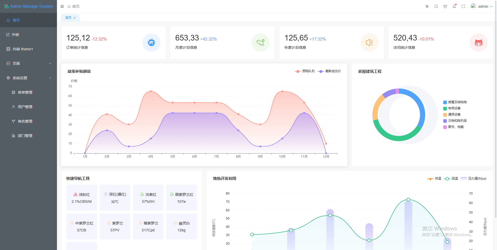
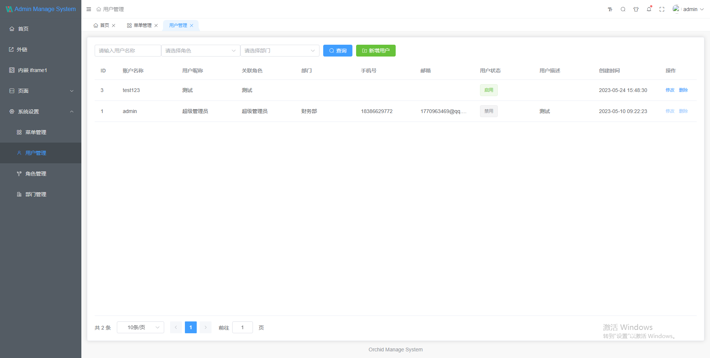
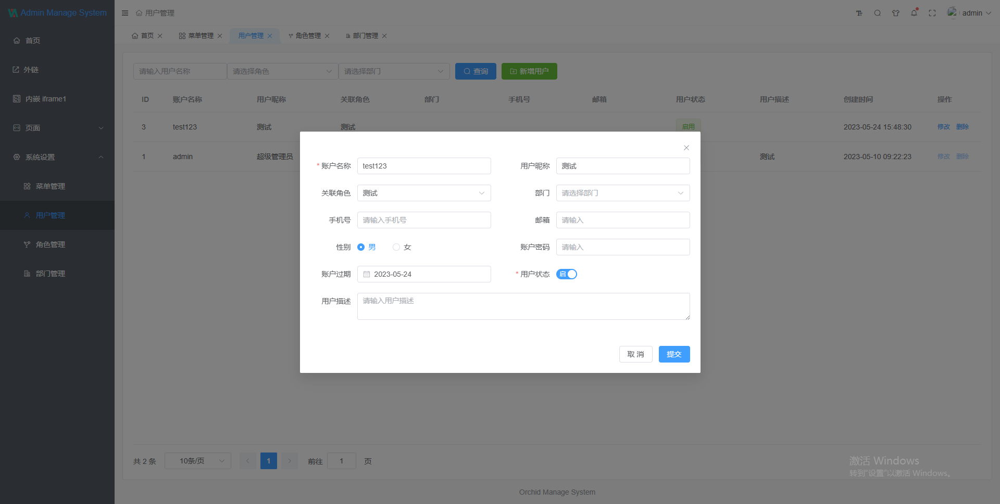
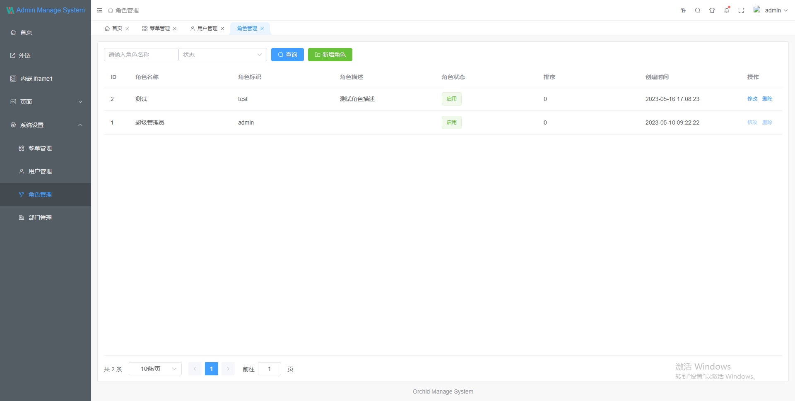
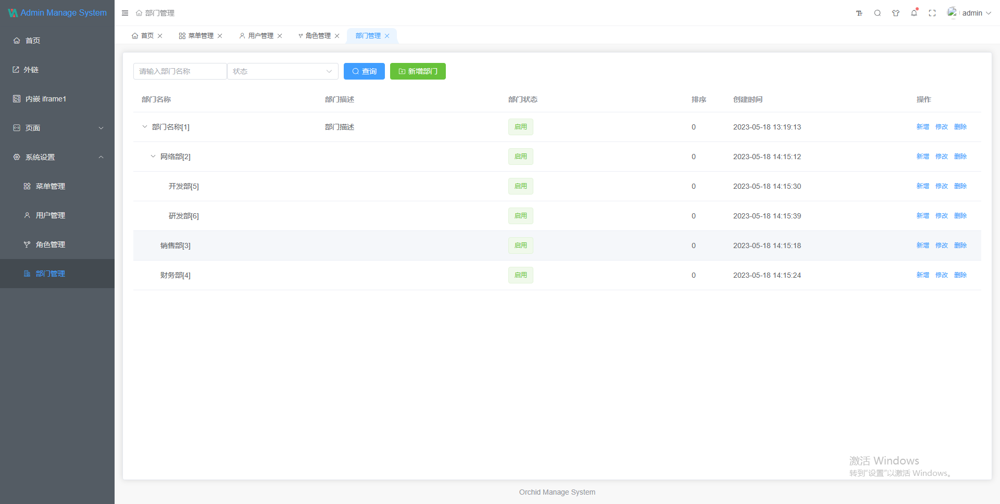

# orchid

`orchid` 是基于`axum` + `prisma-client-rust` 开发的后台管理系统服务端实现。

## 相关文档

- axum: 是一个专注于人体工程学和模块化的 Web 应用程序框架
  - 当前版本: 0.6.8
  - [github 仓库](https://github.com/tokio-rs/axum)
  - [使用例子](https://github.com/tokio-rs/axum/tree/main/examples)
  - [使用文档](https://docs.rs/axum)
- prisma-client-rust：Rust 的类型安全数据库访问，[prisma](https://github.com/prisma/prisma) 的 rust 实现。
  - 当前版本: 0.6.8
  - [github 仓库](https://github.com/Brendonovich/prisma-client-rust)
  - [使用例子](https://github.com/Brendonovich/prisma-client-rust/tree/main/examples)
  - [使用文档](https://prisma.brendonovich.dev/)
  - prisma 支持的数据库：PostgreSQL、MySQL、MariaDB、SQL Server、SQLite、MongoDB、CockroachDB

## 使用方法

1. 安装 rust 环境

2. 生成 prisma 客户端并创建数据库表

   ```rust
   cargo prisma db push
   ```

3. 运行
   ```rust
   cargo run -p admin
   ```

## todo list

- [x] 用户名 + 密码登录
- [ ] 手机号码 + 验证码登录
- [ ] APP 二维码登录
- [x] 菜单管理
- [x] 角色管理
- [x] 部门管理
- [x] 管理员管理
- [ ] 登录日志管理
- [ ] 操作日志管理
- [ ] 用户管理
- [ ] 商户管理
- [ ] CURD 代码生成
- [ ] cli-数据初始化
- [x] cli-菜单数据导入导出
- [ ] cli-角色数据导入导出
- [ ] cli-部门数据导入导出
- [ ] cli-管理员数据导入导出
- [ ] cli-数据初始化

## 前端代码及截图

- [orchid_admin_ui](https://github.com/tingfeng-key/orchid_admin_ui)：基于[vue-next-admin](https://gitee.com/lyt-top/vue-next-admin) 二次开发。
  - 技术栈：vue3.x + CompositionAPI setup 语法糖 + typescript + vite + element plus + vue-router-next + pinia 技术.
  - 适配：手机、平板、pc
  - 截图
    - 
    - 
    - 
    - 
    - 
    - 
